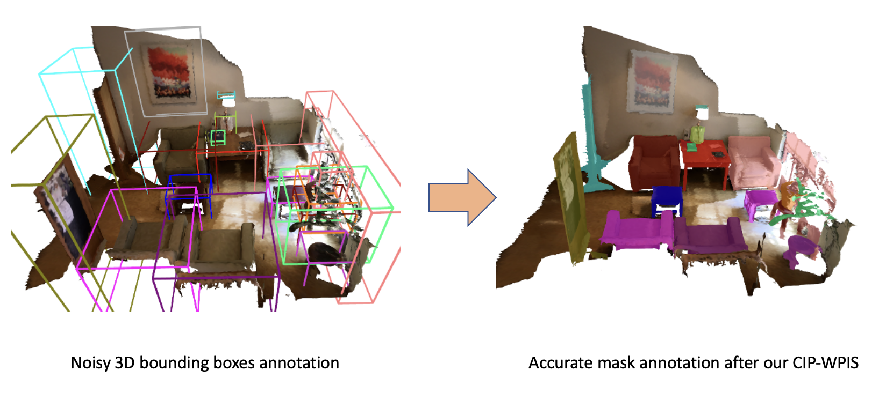
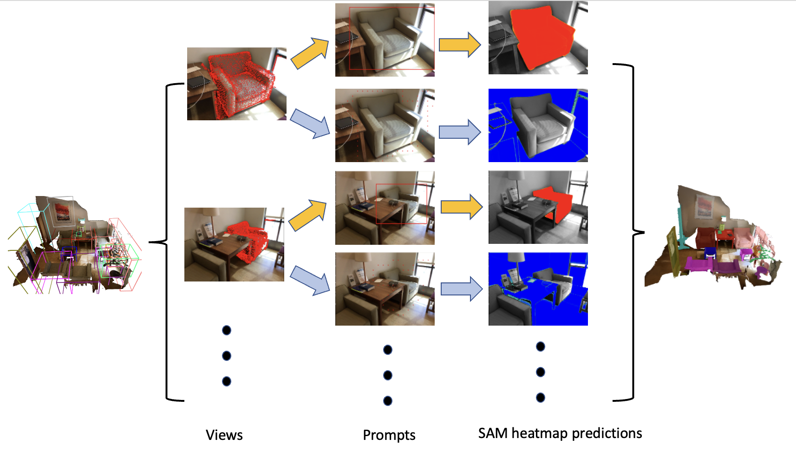

# Weakly-supervised Point Cloud Instance Segmentation from Noisy Bounding Box Annotations via SAM Auto-labeling
- First Author: Qingtao Yu (Research assitant)
- Institutes: Australian National University; University of Queensland

## Abstract
Learning from bounding-boxes annotations has shown great potential in weakly-supervised point cloud instance segmentation. However, we observed that existing methods would suffer severe performance degradation with perturbed bounding box annotations. To tackle this issue, we propose a complementary image prompt-induced weakly-supervised point cloud instance segmentation (CIP-WPIS) method. CIP-WPIS leverages pretrained knowledge embedded in the 2D foundation model [Segment Anything Model](https://github.com/facebookresearch/segment-anything) and 3D geometric prior to achieve accurate point-wise instance labels from the bounding box annotations. Specifically, CP-WPIS first selects projection views in which 3D instance points of interest are fully visible. Then, we generate complementary background and foreground prompts for SAM and employ the SAM heatmap predictions to assign the confidence values for 2D projections in that view. Furthermore, we designed a voting scheme to uniquely assign each point to instances according to the 3D geometric homogeneity of superpoints. In this fashion, we achieved high-quality 3D point-wise instance labels. Extensive experiments on both Scannet-v2 and S3DIS benchmarks demonstrate that our method is robust against noisy 3D bounding-box annotations and achieves state-of-the-art performance.

## Result and Pipline Visualisation





## Installation
```
conda create -n cipwpis
conda activate cipwpis
# Choose version you want here: https://pytorch.org/get-started/previous-versions/
conda install pytorch==1.11.0 torchvision==0.12.0 torchaudio==0.11.0 cudatoolkit=11.3 -c pytorch
pip install git+https://github.com/facebookresearch/segment-anything.git 
pip install -r requirements.txt
```

## Getting Started

First you need to download Scannetv2 dataset and link it to the main folder.
And see the example commands in run.sh


## Citation
Our arxiv and bibtex will be released soon.

